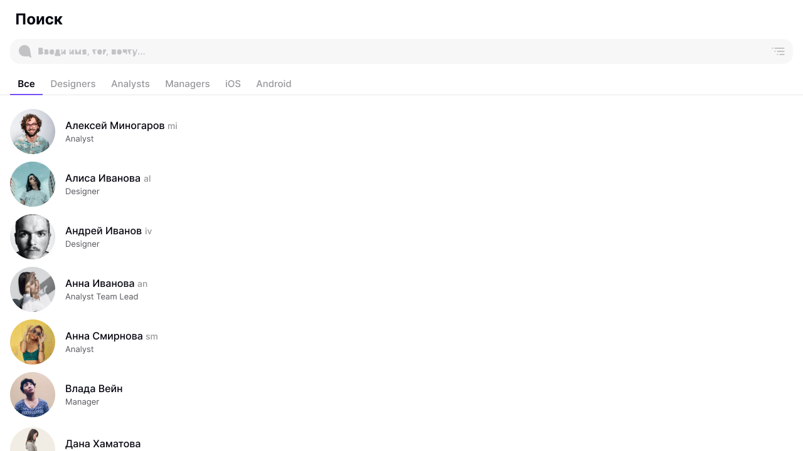
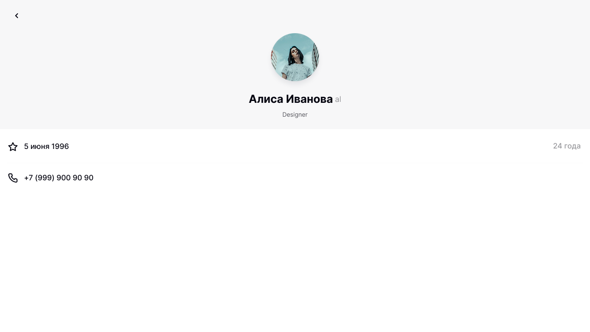
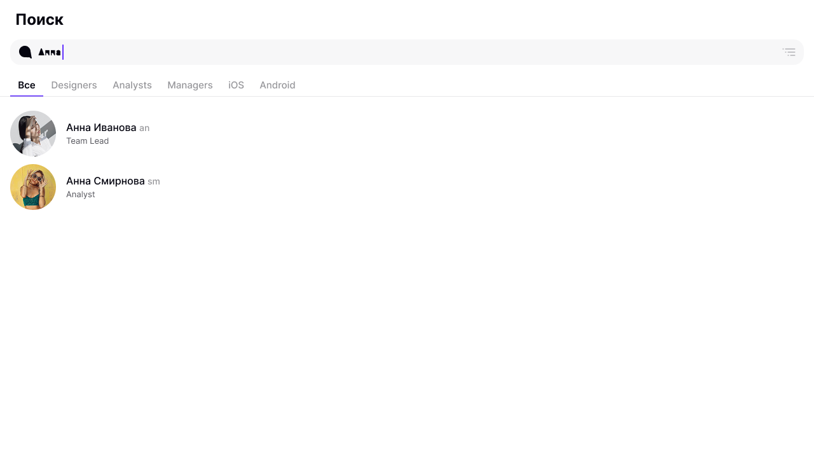

# KODE Internship 2025 - Employee Directory

React + TypeScript приложение для отображения сотрудников компании с фильтрацией, поиском и сортировкой. Разработано в рамках тестового задания для стажировки в KODE.

## 🚀 Демо

[](https://yourusername.github.io/kode-intership-2025-react)

*Приложение размещено на GitHub Pages*

## 📱 Функциональность

- **🔍 Умный поиск** по имени, фамилии и никнейму
- **🏢 Фильтрация по отделам** (14 категорий)
- **📅 Сортировка** по алфавиту и дню рождения
- **👤 Детальные карточки** сотрудников с кликабельными телефонами
- **📱 Адаптивный дизайн** для мобильных устройств
- **⚡ Быстрая загрузка** с использованием скелетонов
- **🔄 Обработка ошибок** и состояний загрузки

## 🛠 Технологии

**Frontend:**
- 
- 
- 
- 

**Инструменты сборки:**
- 
- 

## 📦 Установка и запуск

### Предварительные требования
- Node.js 16+ 
- npm или yarn

### Установка

```bash
# Клонирование репозитория
git clone https://github.com/vyanckus/kode-intership-2025-react.git

# Переход в директорию проекта
cd kode-intership-2025-react

# Установка зависимостей
npm install
```

### Запуск в режиме разработки
 
```bash
npm run dev
```
 
Приложение будет доступно по адресу: `http://localhost:5173`
 
### Сборка для production
 
```bash
npm run build
```
 
### Просмотр собранной версии
 
```bash
npm run preview
```
 
## 🎯 Особенности реализации
 
### Архитектура
 
*   Компонентный подход с разделением ответственности
    
*   TypeScript для типобезопасности
    
*   React Hooks для управления состоянием
    
*   Styled Components для стилизации
    
 
### UI/UX
 
*   Pixel-perfect верстка по макету Figma
    
*   Скелетоны для улучшения UX при загрузке
    
*   Кастомные модальные окна и радио-кнопки
    
*   Доступность (ARIA-атрибуты, семантическая верстка)
    
 
### Производительность
 
*   React.memo и useMemo для оптимизации рендеринга
    
*   useCallback для мемоизации функций
    
*   Ленивая загрузка компонентов
    
 
## 📁 Структура проекта
 
text
 
```
src/
├── api/              # API слой (getUsers.ts)
├── assets/           # Статические ресурсы (иконки)
├── components/       # React компоненты
│   ├── Employee.tsx              # Карточка сотрудника
│   ├── EmployeeList.tsx          # Список сотрудников
│   ├── EmployeeDetails.tsx       # Детальная страница
│   ├── TopAppBar.tsx            # Верхняя панель
│   ├── Filters.tsx              # Фильтры по отделам
│   ├── SortModal.tsx            # Модалка сортировки
│   ├── EmployeeListSkeleton.tsx # Скелетон загрузки
│   └── ErrorScreen.tsx          # Экран ошибки
├── styles/           # Глобальные стили
├── types/            # TypeScript типы
└── App.tsx           # Корневой компонент
```
 
## 🎨 Скриншоты
 
### Главный экран


### Детальная страница  


### Поиск и фильтрация


## 🔧 API
 
Приложение использует [KODE Users API](https://kode-frontend-team.stoplight.io/docs/koder-stoplight/e981f97438300-get-users-list) для получения данных о сотрудниках.
 
Основные endpoints:
 
*   `GET /users?__example=all` \- все сотрудники
    
*   `GET /users?__example=frontend` \- сотрудники по отделам
    

 
## 📄 Лицензия
 
Этот проект создан в рамках тестового задания и предназначен для портфолио. Все права защищены.
 
## 👨‍💻 Автор
 
Фёдор Вянцкус
 
*   GitHub: [@vyanckus](https://github.com/vyanckus)
    
*   Email: vyanckus@mail.ru
    
 
* * *
 
_Разработано для тестового задания стажировки в KODE_